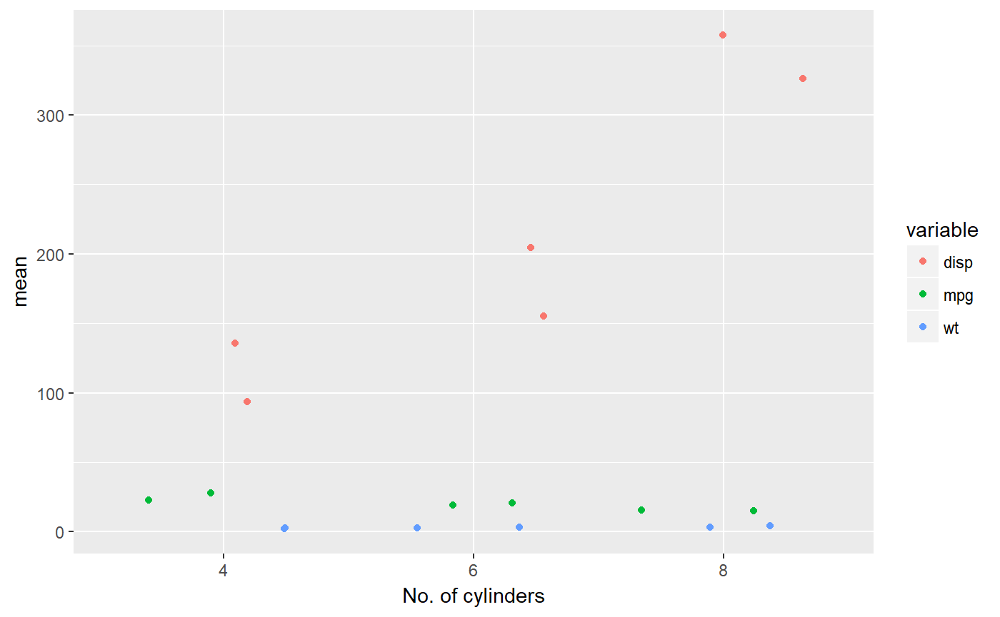

<!-- README.md is generated from README.Rmd. Please edit that file -->

# groupedstats: Grouped statistical analysis in a tidy way

[](commits/master)
[](https://travis-ci.org/IndrajeetPatil/groupedstats)
[](https://ci.appveyor.com/project/IndrajeetPatil/groupedstats)
[](https://www.gnu.org/licenses/gpl-3.0.en.html)
[](http://www.repostatus.org/#active)
[](/commits/master)
[](https://www.tidyverse.org/lifecycle/#experimental)
[](https://cran.r-project.org/)
<!-- [](https://codecov.io/github/IndrajeetPatil/groupedstats?branch=master)
[](https://gemnasium.com/IndrajeetPatil/groupedstats) -->

## Overview

`groupedstats` package provides a collection of functions to run
statistical operations on multiple variables across multiple grouping
variables in a dataframe. **This package is still in development. Use at
your own risk\!**

## Installation

You can get the development version from GitHub. If you are in hurry and
want to reduce the time of installation,
prefer-

``` r
# install.packages("devtools")                                # needed package to download from GitHub repo
devtools::install_github(repo = "IndrajeetPatil/groupedstats", # package path on GitHub
                         quick = TRUE)                        # skips docs, demos, and vignettes
```

If time is not a
constraint-

``` r
devtools::install_github(repo = "IndrajeetPatil/groupedstats", # package path on GitHub
                         dependencies = TRUE,                 # installs packages which groupedstats depends on
                         upgrade_dependencies = TRUE          # updates any out of date dependencies
)
```

## Help

Documentation for any function can be accessed with the standard `help`
command-

``` r
?grouped_summary
?grouped_lm
?grouped_robustlm
?grouped_proptest
?grouped_ttest
```

## Usage

  - `grouped_summary`

Getting summary for multiple variables across multiple grouping
variables.

This is a handy tool if you have just one grouping variable and multiple
variables for which summary statistics are to be computed-

``` r
library(datasets)
options(tibble.width = Inf)            # show me all columns

groupedstats::grouped_summary(data = datasets::iris,
                              grouping.vars = Species,
                              measures = c(Sepal.Length:Petal.Width))
#> # A tibble: 12 x 13
#>    Species    type    variable     missing complete     n  mean    sd
#>    <fct>      <fct>   <fct>          <dbl>    <dbl> <dbl> <dbl> <dbl>
#>  1 setosa     numeric Petal.Length      0.      50.   50. 1.46  0.170
#>  2 setosa     numeric Petal.Width       0.      50.   50. 0.250 0.110
#>  3 setosa     numeric Sepal.Length      0.      50.   50. 5.01  0.350
#>  4 setosa     numeric Sepal.Width       0.      50.   50. 3.43  0.380
#>  5 versicolor numeric Petal.Length      0.      50.   50. 4.26  0.470
#>  6 versicolor numeric Petal.Width       0.      50.   50. 1.33  0.200
#>  7 versicolor numeric Sepal.Length      0.      50.   50. 5.94  0.520
#>  8 versicolor numeric Sepal.Width       0.      50.   50. 2.77  0.310
#>  9 virginica  numeric Petal.Length      0.      50.   50. 5.55  0.550
#> 10 virginica  numeric Petal.Width       0.      50.   50. 2.03  0.270
#> 11 virginica  numeric Sepal.Length      0.      50.   50. 6.59  0.640
#> 12 virginica  numeric Sepal.Width       0.      50.   50. 2.97  0.320
#>      min   p25 median   p75   max
#>    <dbl> <dbl>  <dbl> <dbl> <dbl>
#>  1 1.00  1.40   1.50  1.58  1.90 
#>  2 0.100 0.200  0.200 0.300 0.600
#>  3 4.30  4.80   5.00  5.20  5.80 
#>  4 2.30  3.20   3.40  3.68  4.40 
#>  5 3.00  4.00   4.35  4.60  5.10 
#>  6 1.00  1.20   1.30  1.50  1.80 
#>  7 4.90  5.60   5.90  6.30  7.00 
#>  8 2.00  2.52   2.80  3.00  3.40 
#>  9 4.50  5.10   5.55  5.88  6.90 
#> 10 1.40  1.80   2.00  2.30  2.50 
#> 11 4.90  6.23   6.50  6.90  7.90 
#> 12 2.20  2.80   3.00  3.18  3.80
```

Or multiple grouping variables and multiple variables of interest-

``` r
library(datasets)
library(tidyverse)

groupedstats::grouped_summary(
  data = datasets::mtcars,
  grouping.vars = c(am, cyl),
  measures = c(disp, wt, mpg)
) %>%                                                         # further modification with the pipe operator
  dplyr::select(.data = ., -type, -missing, -complete) %>%    # feeding the output into another function
  ggplot2::ggplot(data = .,                                   # note that `.` is just a placeholder for data here
                  mapping = ggplot2::aes(x = as.factor(cyl), 
                                         y = mean, 
                                         color = variable)) +
  ggplot2::geom_jitter() +
  ggplot2::labs(x = "No. of cylinders", y = "mean")
```

<!-- -->

As demonstrated, the output from the function is further modifiable and
can be directly outputed into other routines (e.g., preparing a plot of
`mean` and `sd` values in `ggplot2`).

  - `grouped_lm`

This function can be used to run linear regression between different
pairs of variables across multiple levels of grouping variables. For
example, if we want to assess the linear relationship between
`Sepal.Length` and `Sepal.Width`, **and** `Sepal.Length` and
`Sepal.Width` (notice the order in which variables are being entered)
for all levels of `Species`:

``` r
library(datasets)
options(tibble.width = Inf)            # show me all columns

groupedstats::grouped_lm(data = datasets::iris,
                         dep.vars = c(Sepal.Length, Petal.Length),
                         indep.vars = c(Sepal.Width, Petal.Width),
                         grouping.vars = Species)
#> # A tibble: 6 x 9
#>   Species    formula                    t.value estimate conf.low
#>   <fct>      <chr>                        <dbl>    <dbl>    <dbl>
#> 1 setosa     Sepal.Length ~ Sepal.Width    7.68    0.743   0.548 
#> 2 versicolor Sepal.Length ~ Sepal.Width    4.28    0.526   0.279 
#> 3 virginica  Sepal.Length ~ Sepal.Width    3.56    0.457   0.199 
#> 4 setosa     Petal.Length ~ Petal.Width    2.44    0.332   0.0578
#> 5 versicolor Petal.Length ~ Petal.Width    8.83    0.787   0.607 
#> 6 virginica  Petal.Length ~ Petal.Width    2.36    0.322   0.0474
#>   conf.high std.error  p.value significance
#>       <dbl>     <dbl>    <dbl> <chr>       
#> 1     0.937    0.0967 6.71e-10 ***         
#> 2     0.773    0.123  8.77e- 5 ***         
#> 3     0.715    0.128  8.43e- 4 ***         
#> 4     0.605    0.136  1.86e- 2 *           
#> 5     0.966    0.0891 1.27e-11 ***         
#> 6     0.597    0.137  2.25e- 2 *
```

This can be done with multiple grouping variables. For example, in the
following example, we use the `gapminder` dataset to regress life
expectency and population on GDP per capita for each continent and for
each country.

``` r
library(gapminder)
library(dplyr)
options(tibble.width = Inf)            # show me all columns

groupedstats::grouped_lm(data = gapminder::gapminder,
                         dep.vars = c(lifeExp, pop),
                         indep.vars = c(gdpPercap, gdpPercap),
                         grouping.vars = c(continent, country)) %>%
  dplyr::arrange(.data = ., continent, country)
#> # A tibble: 284 x 10
#>    continent country      formula              t.value estimate conf.low
#>    <fct>     <fct>        <chr>                  <dbl>    <dbl>    <dbl>
#>  1 Africa    Algeria      lifeExp ~ gdpPercap   6.71    0.904      0.604
#>  2 Africa    Algeria      pop ~ gdpPercap       5.04    0.847      0.473
#>  3 Africa    Angola       lifeExp ~ gdpPercap  -0.998  -0.301     -0.973
#>  4 Africa    Angola       pop ~ gdpPercap      -0.964  -0.292     -0.966
#>  5 Africa    Benin        lifeExp ~ gdpPercap   4.98    0.844      0.466
#>  6 Africa    Benin        pop ~ gdpPercap       6.97    0.911      0.620
#>  7 Africa    Botswana     lifeExp ~ gdpPercap   0.0177  0.00560   -0.699
#>  8 Africa    Botswana     pop ~ gdpPercap      18.3     0.985      0.865
#>  9 Africa    Burkina Faso lifeExp ~ gdpPercap   5.91    0.882      0.549
#> 10 Africa    Burkina Faso pop ~ gdpPercap       7.43    0.920      0.644
#>    conf.high std.error       p.value significance
#>        <dbl>     <dbl>         <dbl> <chr>       
#>  1     1.21     0.135  0.0000533     ***         
#>  2     1.22     0.168  0.000503      ***         
#>  3     0.371    0.302  0.342         ns          
#>  4     0.382    0.302  0.358         ns          
#>  5     1.22     0.170  0.000557      ***         
#>  6     1.20     0.131  0.0000386     ***         
#>  7     0.710    0.316  0.986         ns          
#>  8     1.11     0.0539 0.00000000515 ***         
#>  9     1.21     0.149  0.000149      ***         
#> 10     1.20     0.124  0.0000223     ***         
#> # ... with 274 more rows
```

  - `grouped_robustlm`

There is also robust variant of linear regression (as implemented in
`robust::lmRob`)-

``` r
library(gapminder)
library(dplyr)
options(tibble.width = Inf)            # show me all columns

groupedstats::grouped_robustlm(data = gapminder::gapminder,
                         dep.vars = c(lifeExp, pop),
                         indep.vars = c(gdpPercap, gdpPercap),
                         grouping.vars = c(continent, country)) %>%
  dplyr::arrange(.data = ., continent, country)
#> # A tibble: 284 x 8
#>    continent country      formula             t.value estimate std.error
#>    <fct>     <fct>        <chr>                 <dbl>    <dbl>     <dbl>
#>  1 Africa    Algeria      lifeExp ~ gdpPercap   5.82     0.904    0.155 
#>  2 Africa    Algeria      pop ~ gdpPercap       2.49     0.869    0.349 
#>  3 Africa    Angola       lifeExp ~ gdpPercap  -0.734   -0.413    0.563 
#>  4 Africa    Angola       pop ~ gdpPercap      -2.45    -0.541    0.221 
#>  5 Africa    Benin        lifeExp ~ gdpPercap   2.46     0.773    0.315 
#>  6 Africa    Benin        pop ~ gdpPercap       7.18     0.929    0.129 
#>  7 Africa    Botswana     lifeExp ~ gdpPercap   4.42     1.47     0.332 
#>  8 Africa    Botswana     pop ~ gdpPercap      15.3      1.08     0.0706
#>  9 Africa    Burkina Faso lifeExp ~ gdpPercap   2.14     0.882    0.413 
#> 10 Africa    Burkina Faso pop ~ gdpPercap       7.17     0.920    0.128 
#>         p.value significance
#>           <dbl> <chr>       
#>  1 0.000168     ***         
#>  2 0.0319       *           
#>  3 0.480        ns          
#>  4 0.0344       *           
#>  5 0.0338       *           
#>  6 0.0000299    ***         
#>  7 0.00130      **          
#>  8 0.0000000294 ***         
#>  9 0.0583       ns          
#> 10 0.0000304    ***         
#> # ... with 274 more rows
```

  - `grouped_proptest`

This function helps carry out one-sample proportion tests with a unique
variable for multiple grouping variables-

``` r
library(datasets)
options(tibble.width = Inf)            # show me all columns

groupedstats::grouped_proptest(data = mtcars,
                               grouping.vars = cyl,
                               measure = am)
#> # A tibble: 3 x 7
#>     cyl `0`    `1`    `Chi-squared`    df `p-value` significance
#>   <dbl> <chr>  <chr>          <dbl> <dbl>     <dbl> <chr>       
#> 1    6. 57.14% 42.86%         0.143    1.   0.705   ns          
#> 2    4. 27.27% 72.73%         2.27     1.   0.132   ns          
#> 3    8. 85.71% 14.29%         7.14     1.   0.00800 **
```

  - `grouped_ttest`

This function can help you carry out t-tests, paired or independent, on
multiple variables across multiple groups. Deomostrating how to use this
function is going to first require getting the `iris` dataset into long
format. Let’s say we want to investigate if `Sepal` part of the flower
has greater measurement (length or width) than `Petal` part of the
flower for **each** *Iris* species.

``` r
# loading the necessary libraries
library(tidyverse)

# converting the iris dataset to long format
iris_long <- datasets::iris %>%
  dplyr::mutate(.data = ., id = dplyr::row_number(x = Species)) %>%
  tidyr::gather(
    data = .,
    key = "condition",
    value = "value",
    Sepal.Length:Petal.Width,
    convert = TRUE,
    factor_key = TRUE
  ) %>%
  tidyr::separate(
    col = "condition",
    into = c("part", "measure"),
    sep = "\\.",
    convert = TRUE
  ) %>%
  tibble::as_data_frame(x = .)

# check the long format iris dataset
iris_long
#> # A tibble: 600 x 5
#>    Species    id part  measure value
#>    <fct>   <int> <chr> <chr>   <dbl>
#>  1 setosa      1 Sepal Length   5.10
#>  2 setosa      2 Sepal Length   4.90
#>  3 setosa      3 Sepal Length   4.70
#>  4 setosa      4 Sepal Length   4.60
#>  5 setosa      5 Sepal Length   5.00
#>  6 setosa      6 Sepal Length   5.40
#>  7 setosa      7 Sepal Length   4.60
#>  8 setosa      8 Sepal Length   5.00
#>  9 setosa      9 Sepal Length   4.40
#> 10 setosa     10 Sepal Length   4.90
#> # ... with 590 more rows

# checking if the Sepal part has different dimentions (value) than Petal part
# for each Species and for each type of measurement (Length and Width)
options(tibble.width = Inf)            # show me all columns

groupedstats::grouped_ttest(
  data = iris_long,
  dep.vars = value,                    # dependent variable
  indep.vars = part,                   # independent variable
  grouping.vars = c(Species, measure), # for each Species and for each measurement
  paired = TRUE                        # paired t-test
)
#> # A tibble: 6 x 11
#>   Species    measure formula      method        t.test estimate conf.low
#>   <fct>      <chr>   <chr>        <fct>          <dbl>    <dbl>    <dbl>
#> 1 setosa     Length  value ~ part Paired t-test  -71.8   -3.54     -3.64
#> 2 versicolor Length  value ~ part Paired t-test  -34.0   -1.68     -1.78
#> 3 virginica  Length  value ~ part Paired t-test  -22.9   -1.04     -1.13
#> 4 setosa     Width   value ~ part Paired t-test  -61.0   -3.18     -3.29
#> 5 versicolor Width   value ~ part Paired t-test  -43.5   -1.44     -1.51
#> 6 virginica  Width   value ~ part Paired t-test  -23.1   -0.948    -1.03
#>   conf.high parameter  p.value significance
#>       <dbl>     <dbl>    <dbl> <chr>       
#> 1    -3.44        49. 2.54e-51 ***         
#> 2    -1.58        49. 9.67e-36 ***         
#> 3    -0.945       49. 7.99e-28 ***         
#> 4    -3.08        49. 7.21e-48 ***         
#> 5    -1.38        49. 8.42e-41 ***         
#> 6    -0.866       49. 5.34e-28 ***
```

  - `grouped_wilcox`

This function is just non-parametric variant of the
`grouped_ttest`:

``` r
# checking if the Sepal part has different dimentions (value) than Petal part
# for each Species and for each type of measurement (Length and Width)
options(tibble.width = Inf)            # show me all columns

groupedstats::grouped_wilcox(
  data = iris_long,
  dep.vars = value,                    # dependent variable
  indep.vars = part,                   # independent variable
  grouping.vars = c(Species, measure), # for each Species and for each measurement
  paired = TRUE                        # paired Wilcoxon signed rank test with continuity correction
)
#> # A tibble: 6 x 10
#>   Species    measure formula     
#>   <fct>      <chr>   <chr>       
#> 1 setosa     Length  value ~ part
#> 2 versicolor Length  value ~ part
#> 3 virginica  Length  value ~ part
#> 4 setosa     Width   value ~ part
#> 5 versicolor Width   value ~ part
#> 6 virginica  Width   value ~ part
#>   method                                               statistic estimate
#>   <fct>                                                    <dbl>    <dbl>
#> 1 Wilcoxon signed rank test with continuity correction        0.   -3.55 
#> 2 Wilcoxon signed rank test with continuity correction        0.   -1.70 
#> 3 Wilcoxon signed rank test with continuity correction        0.   -1.05 
#> 4 Wilcoxon signed rank test with continuity correction        0.   -3.15 
#> 5 Wilcoxon signed rank test with continuity correction        0.   -1.45 
#> 6 Wilcoxon signed rank test with continuity correction        0.   -0.950
#>   conf.low conf.high  p.value significance
#>      <dbl>     <dbl>    <dbl> <chr>       
#> 1    -3.65    -3.45  7.62e-10 ***         
#> 2    -1.80    -1.60  7.45e-10 ***         
#> 3    -1.15    -0.950 7.48e-10 ***         
#> 4    -3.25    -3.10  7.40e-10 ***         
#> 5    -1.55    -1.40  7.58e-10 ***         
#> 6    -1.00    -0.850 7.67e-10 ***
```

While we are at it, let’s also check out examples for `t-test` and
`Wilcox test` in case of between-subjects designs.

We will use `diamonds` dataset from `ggplot2` and will see if the price
and depth of a diamond is different for two of our favorite colors (say
`E` and `J`) for each type of clarity.

``` r

# subset the dataframe with two colors of interest to us
diamonds_short <-
  dplyr::filter(.data = ggplot2::diamonds, color == "E" |
                  color == "J")

options(tibble.width = Inf, tibble.print_max = Inf)             # show me all rows and columns

# t-test
groupedstats::grouped_ttest(
  data = diamonds_short,
  dep.vars = c(carat, price, depth),             # note that there three independent variables 
  indep.vars = color,                            # and just one dependent variable 
  grouping.vars = clarity,                       # one grouping variable
  paired = FALSE,
  var.equal = FALSE
)
#> # A tibble: 24 x 10
#>    clarity formula       method                   t.test   estimate
#>    <ord>   <chr>         <fct>                     <dbl>      <dbl>
#>  1 SI2     carat ~ color Welch Two Sample t-test -18.0      -0.503 
#>  2 SI1     carat ~ color Welch Two Sample t-test -22.1      -0.462 
#>  3 VS1     carat ~ color Welch Two Sample t-test -16.8      -0.444 
#>  4 VVS2    carat ~ color Welch Two Sample t-test -12.0      -0.553 
#>  5 VS2     carat ~ color Welch Two Sample t-test -24.6      -0.542 
#>  6 I1      carat ~ color Welch Two Sample t-test  -4.48     -0.644 
#>  7 VVS1    carat ~ color Welch Two Sample t-test  -6.53     -0.417 
#>  8 IF      carat ~ color Welch Two Sample t-test  -2.38     -0.198 
#>  9 SI2     price ~ color Welch Two Sample t-test -10.6   -2347.    
#> 10 SI1     price ~ color Welch Two Sample t-test -12.6   -2024.    
#> 11 VS1     price ~ color Welch Two Sample t-test  -9.26  -2028.    
#> 12 VVS2    price ~ color Welch Two Sample t-test  -6.83  -2643.    
#> 13 VS2     price ~ color Welch Two Sample t-test -14.3   -2560.    
#> 14 I1      price ~ color Welch Two Sample t-test  -2.76  -1766.    
#> 15 VVS1    price ~ color Welch Two Sample t-test  -3.35  -1814.    
#> 16 IF      price ~ color Welch Two Sample t-test   0.378   305.    
#> 17 SI2     depth ~ color Welch Two Sample t-test  -2.64     -0.231 
#> 18 SI1     depth ~ color Welch Two Sample t-test   0.333     0.0208
#> 19 VS1     depth ~ color Welch Two Sample t-test  -6.61     -0.417 
#> 20 VVS2    depth ~ color Welch Two Sample t-test  -2.20     -0.277 
#> 21 VS2     depth ~ color Welch Two Sample t-test  -2.28     -0.145 
#> 22 I1      depth ~ color Welch Two Sample t-test  -3.96     -2.10  
#> 23 VVS1    depth ~ color Welch Two Sample t-test  -2.53     -0.370 
#> 24 IF      depth ~ color Welch Two Sample t-test  -2.16     -0.386 
#>     conf.low  conf.high parameter   p.value significance
#>        <dbl>      <dbl>     <dbl>     <dbl> <chr>       
#>  1    -0.558    -0.448      634.  9.24e- 59 ***         
#>  2    -0.503    -0.420      948.  2.47e- 87 ***         
#>  3    -0.496    -0.392      663.  2.91e- 53 ***         
#>  4    -0.644    -0.461      140.  3.81e- 23 ***         
#>  5    -0.586    -0.499      856.  1.51e-101 ***         
#>  6    -0.932    -0.357       60.6 3.34e-  5 ***         
#>  7    -0.545    -0.290       76.1 6.68e-  9 ***         
#>  8    -0.364    -0.0318      60.1 2.03e-  2 *           
#>  9 -2782.    -1913.         676.  2.02e- 24 ***         
#> 10 -2339.    -1709.        1031.  5.75e- 34 ***         
#> 11 -2458.    -1598.         794.  1.86e- 19 ***         
#> 12 -3407.    -1878.         151.  1.94e- 10 ***         
#> 13 -2911.    -2209.         943.  3.07e- 42 ***         
#> 14 -3044.     -487.          62.0 7.58e-  3 **          
#> 15 -2893.     -735.          81.2 1.24e-  3 **          
#> 16 -1299.     1909.          81.0 7.07e-  1 ns          
#> 17    -0.402    -0.0588     772.  8.58e-  3 **          
#> 18    -0.102     0.143     1245.  7.39e-  1 ns          
#> 19    -0.541    -0.293     1040.  6.08e- 11 ***         
#> 20    -0.526    -0.0279     158.  2.95e-  2 *           
#> 21    -0.271    -0.0203    1084.  2.28e-  2 *           
#> 22    -3.16     -1.05        81.6 1.61e-  4 ***         
#> 23    -0.661    -0.0792      88.1 1.32e-  2 *           
#> 24    -0.739    -0.0321     111.  3.28e-  2 *

# wilcox test (aka Mann-Whitney U-test)
groupedstats::grouped_wilcox(
  data = diamonds_short,
  dep.vars = depth:price,                        # note that you can select variables in a range
  indep.vars = color,                            # again, just one dependent variable
  grouping.vars = clarity,                       # one grouping variable
  paired = FALSE
)
#> # A tibble: 16 x 9
#>    clarity formula       method                                           
#>    <ord>   <chr>         <fct>                                            
#>  1 SI2     depth ~ color Wilcoxon rank sum test with continuity correction
#>  2 SI1     depth ~ color Wilcoxon rank sum test with continuity correction
#>  3 VS1     depth ~ color Wilcoxon rank sum test with continuity correction
#>  4 VVS2    depth ~ color Wilcoxon rank sum test with continuity correction
#>  5 VS2     depth ~ color Wilcoxon rank sum test with continuity correction
#>  6 I1      depth ~ color Wilcoxon rank sum test with continuity correction
#>  7 VVS1    depth ~ color Wilcoxon rank sum test with continuity correction
#>  8 IF      depth ~ color Wilcoxon rank sum test with continuity correction
#>  9 SI2     price ~ color Wilcoxon rank sum test with continuity correction
#> 10 SI1     price ~ color Wilcoxon rank sum test with continuity correction
#> 11 VS1     price ~ color Wilcoxon rank sum test with continuity correction
#> 12 VVS2    price ~ color Wilcoxon rank sum test with continuity correction
#> 13 VS2     price ~ color Wilcoxon rank sum test with continuity correction
#> 14 I1      price ~ color Wilcoxon rank sum test with continuity correction
#> 15 VVS1    price ~ color Wilcoxon rank sum test with continuity correction
#> 16 IF      price ~ color Wilcoxon rank sum test with continuity correction
#>    statistic      estimate   conf.low     conf.high  p.value significance
#>        <dbl>         <dbl>      <dbl>         <dbl>    <dbl> <chr>       
#>  1   380600.    -0.200        -0.300     -0.0000364 1.54e- 2 *           
#>  2   918892.     0.0000393    -0.1000     0.100     6.77e- 1 ns          
#>  3   276743.    -0.400        -0.500     -0.300     7.03e-12 ***         
#>  4    52618.    -0.400        -0.600     -0.200     4.18e- 4 ***         
#>  5   816784.    -0.200        -0.300     -0.1000    8.86e- 5 ***         
#>  6     1570.    -2.00         -3.00      -1.000     1.21e- 4 ***         
#>  7    19455.    -0.300        -0.500     -0.1000    5.07e- 3 **          
#>  8     3286.    -0.300        -0.700     -0.0000251 4.79e- 2 *           
#>  9   269016. -1844.        -2182.     -1505.        8.82e-31 ***         
#> 10   608724. -1510.        -1789.     -1312.        8.20e-43 ***         
#> 11   277389. -1095.        -1414.      -745.        1.11e-11 ***         
#> 12    42795. -1764.        -2920.     -1205.        2.23e-10 ***         
#> 13   560930. -1888.        -2228.     -1539.        1.08e-54 ***         
#> 14     2017. -1150.        -1832.       -79.0       3.68e- 2 *           
#> 15    19086.  -362.         -859.      -107.        2.57e- 3 **          
#> 16     5085.   296.          125.       449.        4.94e- 3 **
```

We can further focus just on two levels of clarity to further elucidate
another aspect of entering the arguments-

``` r
# subset the dataframe even further to just select two levels of clarity
diamonds_short2 <-
  dplyr::filter(.data = diamonds_short, clarity == "SI2" |
                  clarity == "SI1")

# wilcox test (aka Mann-Whitney U-test)
groupedstats::grouped_wilcox(
 data = diamonds_short2,
  dep.vars = c(carat, price),                    # two independent variables
  indep.vars = c(color, clarity),                # and just one dependent variable 
  grouping.vars = cut,                           # one grouping variable
  paired = FALSE
)
#> # A tibble: 10 x 9
#>    cut       formula        
#>    <ord>     <chr>          
#>  1 Ideal     carat ~ color  
#>  2 Premium   carat ~ color  
#>  3 Good      carat ~ color  
#>  4 Very Good carat ~ color  
#>  5 Fair      carat ~ color  
#>  6 Ideal     price ~ clarity
#>  7 Premium   price ~ clarity
#>  8 Good      price ~ clarity
#>  9 Very Good price ~ clarity
#> 10 Fair      price ~ clarity
#>    method                                            statistic estimate
#>    <fct>                                                 <dbl>    <dbl>
#>  1 Wilcoxon rank sum test with continuity correction   103150.   -0.440
#>  2 Wilcoxon rank sum test with continuity correction    91748.   -0.540
#>  3 Wilcoxon rank sum test with continuity correction    20752.   -0.400
#>  4 Wilcoxon rank sum test with continuity correction    87590.   -0.390
#>  5 Wilcoxon rank sum test with continuity correction     2356.   -0.230
#>  6 Wilcoxon rank sum test with continuity correction   344274.  774.   
#>  7 Wilcoxon rank sum test with continuity correction   329276.  876.   
#>  8 Wilcoxon rank sum test with continuity correction    64082.  516.   
#>  9 Wilcoxon rank sum test with continuity correction   272064.  752.   
#> 10 Wilcoxon rank sum test with continuity correction     5113.  170.   
#>    conf.low conf.high  p.value significance
#>       <dbl>     <dbl>    <dbl> <chr>       
#>  1   -0.500    -0.380 1.28e-51 ***         
#>  2   -0.600    -0.490 1.82e-59 ***         
#>  3   -0.500    -0.310 4.49e-18 ***         
#>  4   -0.460    -0.320 7.06e-37 ***         
#>  5   -0.370    -0.110 1.21e- 5 ***         
#>  6  536.     1075.    3.00e- 9 ***         
#>  7  538.     1278.    3.52e- 9 ***         
#>  8  141.      921.    3.05e- 3 **          
#>  9  486.     1098.    2.76e- 8 ***         
#> 10 -411.      802.    5.68e- 1 ns
```

In these examples, two things are worth noting that generalize to
**all** functions in this package and stem from how [`tidy
evaluation`](https://adv-r.hadley.nz/evaluation.html) works: <br /> -
**1.** If just one independent variable is provided for multiple
dependent variables, it will be used as a common variable. <br /> -
**2.** If you want to use a selection of variables, you shouldn’t use
`c()`.
